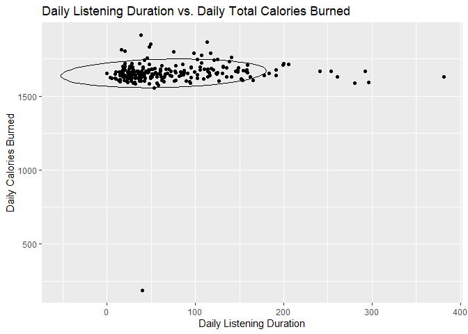
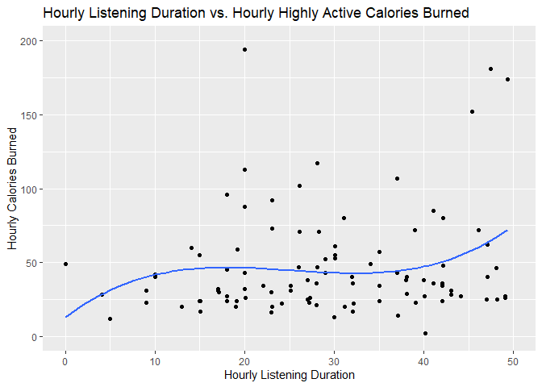
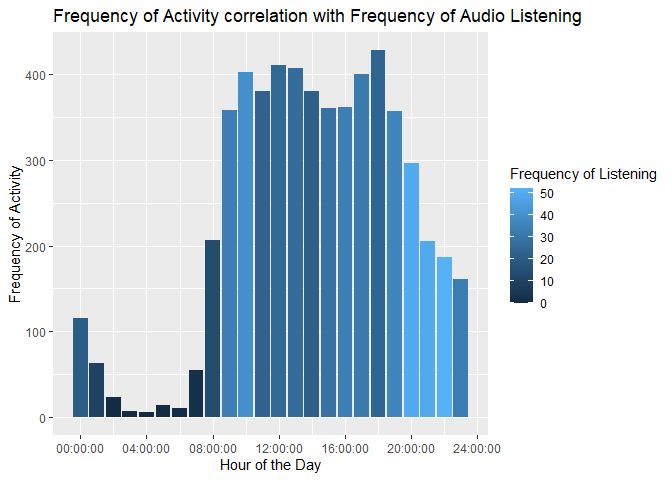
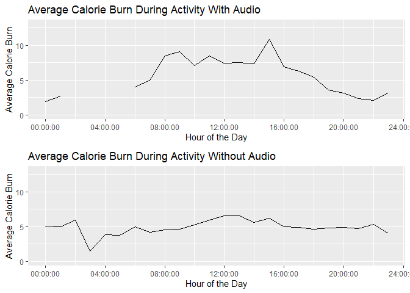
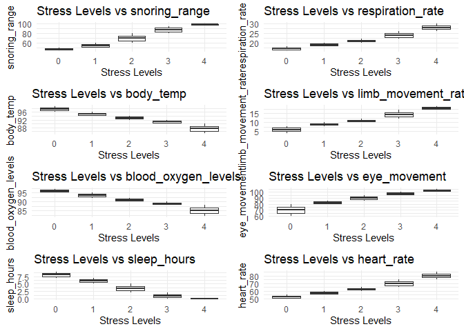
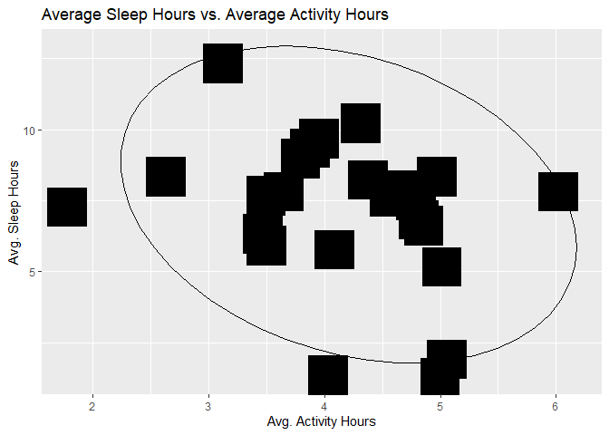
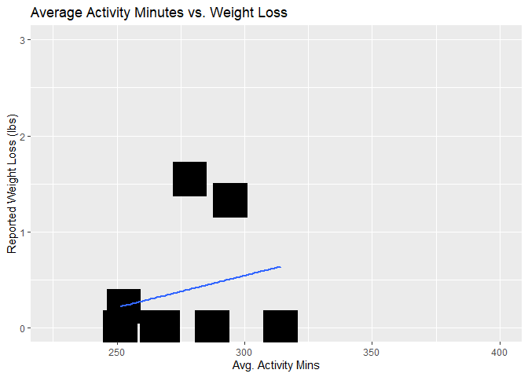
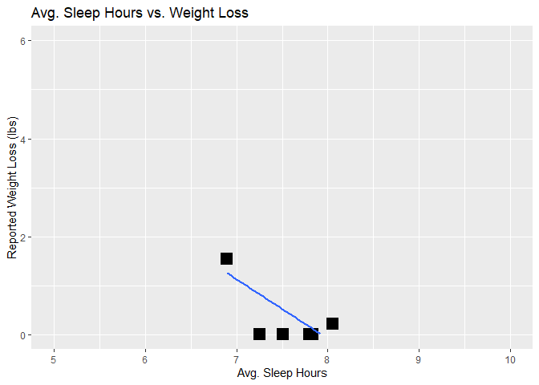

Health Device Utilization
================
Nick Costanzo
2024-11-13

# Bellabeat Case-Study:

<figure>

<figcaption aria-hidden="true">Bellabeat Logo</figcaption>
</figure>

## Smart Device Utilization Trends Analysis

### Business Task (The Ask)

#### Provide analysis of Bellabeat competitor products (like Fitbit, Applewatch, etc.) smart-device health data in order to enable the marketing team with more targeted campaign strategies.

------------------------------------------------------------------------

### Processing the Data

#### Source Datasets

[Kaggle Dataset -
FitBit](https://www.kaggle.com/datasets/arashnic/fitbit)

Data set suggested by Srsen - contains two separate directories that
have data describing FitBit user activity for March through April, and
April through May. We will import this directly from the website into
our RStudio workbook ‘dataset’ directory and process the data for
analysis from there.

Metrics include:

- Daily Activity
- Heart Rate
- Hourly Calories
- Hourly Intensities
- Hourly Steps
- Calories burned per minute
- Sleep Minutes
- Weight Logs

[Kaggle Dataset - Human Stress Detection in and Through
Sleep](https://www.kaggle.com/datasets/laavanya/human-stress-detection-in-and-through-sleep)

A case study for a ‘Smart Yoga Pillow’ product that focused on
identifying a relationship between stress and sleep. It contains a
variety of sleep metrics that we could consider for the stakeholders
investigation into trends of smart device usage. Since Bellabeat’s
products also have the functionality to track sleep metrics, this could
provide insights on how to best market Bellabeat’s products to users
with corresponding sleep habits.

Metrics Include:

- respiration rate
- body temperature
- limb movement rate
- bloood oxygen levels
- eye movement
- number of hours of sleep
- heart rate
- stress levels

Citations:

L. Rachakonda, A. K. Bapatla, S. P. Mohanty, and E. Kougianos,
“SaYoPillow: Blockchain-Integrated Privacy-Assured IoMT Framework for
Stress Management Considering Sleeping Habits”, IEEE Transactions on
Consumer Electronics (TCE), Vol. 67, No. 1, Feb 2021, pp. 20-29.

L. Rachakonda, S. P. Mohanty, E. Kougianos, K. Karunakaran, and M.
Ganapathiraju, “Smart-Pillow: An IoT based Device for Stress Detection
Considering Sleeping Habits”, in Proceedings of the 4th IEEE
International Symposium on Smart Electronic Systems (iSES), 2018,
pp. 161–166.

[Kaggle Dataset - Apple Health Sleep Stages and Heart
Rate](https://www.kaggle.com/datasets/aeryss/apple-health-sleep-stages-and-heart-rate)

Another dataset containing sleep tracking metrics submitted from Apple
Watch owners. The files appear to be split by user and by categories of
sleep metric (heart_rate, lables, motion, steps). We can also
investigate this data to find trends in sleeping that we could present
to Srsen as a potential high-impact demographic for some of Bellabeat’s
devices that also track sleep metrics.

Metrics Include:

- Heart Rate
- Motion
- Steps

[Kaggle Dataset - Health App
Data](https://www.kaggle.com/datasets/dannyperez014/health-app-data-2017-2024)

Apple’s health app data public dataset. This dataset has a number of
aspects associated with health metrics tracked through apples health
applications.

Metrics Include: \* Energy Burned \* Walking Steadiness \* Basal Energy
\* Cals \* Dist Walking & Running \* Stairs Climbed \* Headphone Audio
\* Sleep Analysis \* Step_counts \* Walking Asymmetry \* Walking Double
Support \* Walking Speeds \* Walking Step Lengths

Reliable data sources of health data from Garner Products, Samsung, or
Amazfit were not readily available, so this analysis is based on the
provided *fitbit* data from Urska Srsen, data from a ‘smart pillow’
product case called ‘SaYo Pillow’ and *Sleep Metric Data* collected from
a few smart devices

    ## ── Attaching core tidyverse packages ──────────────────────── tidyverse 2.0.0 ──
    ## ✔ dplyr     1.1.4     ✔ readr     2.1.5
    ## ✔ forcats   1.0.0     ✔ stringr   1.5.1
    ## ✔ ggplot2   3.5.1     ✔ tibble    3.2.1
    ## ✔ lubridate 1.9.3     ✔ tidyr     1.3.1
    ## ✔ purrr     1.0.2     
    ## ── Conflicts ────────────────────────────────────────── tidyverse_conflicts() ──
    ## ✖ dplyr::filter() masks stats::filter()
    ## ✖ dplyr::lag()    masks stats::lag()
    ## ℹ Use the conflicted package (<http://conflicted.r-lib.org/>) to force all conflicts to become errors
    ## ------------------------------------------------------------------------------
    ## 
    ## You have loaded plyr after dplyr - this is likely to cause problems.
    ## If you need functions from both plyr and dplyr, please load plyr first, then dplyr:
    ## library(plyr); library(dplyr)
    ## 
    ## ------------------------------------------------------------------------------
    ## 
    ## 
    ## Attaching package: 'plyr'
    ## 
    ## 
    ## The following objects are masked from 'package:dplyr':
    ## 
    ##     arrange, count, desc, failwith, id, mutate, rename, summarise,
    ##     summarize
    ## 
    ## 
    ## The following object is masked from 'package:purrr':
    ## 
    ##     compact
    ## 
    ## 
    ## 
    ## Attaching package: 'gridExtra'
    ## 
    ## 
    ## The following object is masked from 'package:dplyr':
    ## 
    ##     combine

#### **Reason for using R**

I used R for every step of this project because I am already fairly well
versed with Tableau and SQL from prior work experience.

### Preparation of the data

The data has been input into this Rstudio workbook and is ready to be
investigated further to assist Srsen and the Marketting team with their
strategy based on smart device utilization.

Key tasks 1. Download data and store it appropriately. \* Data is
downloaded from the kaggle website utilizing CURL and data.download
packages in R. Directories created under the ‘datasets’ folder in this R
repository to store and organize these data in the structure made
available through the CURL endpoint.

2.  Identify how it’s organized.

- File name indicates the contents of the files for a lot of these. Each
  dataset was stored based on the individual file names and the Kaggle
  project they belonged to.
- The Fit bit dataset specifically has two directories, each
  representing one months worth of user activity data. Can be derived
  from the data so perhaps there’s a way to rename those dataframes in
  the list accordingly.

3.  Sort and filter the data.

- The data has been sorted into individual data frames in R. The files
  have also been downloaded and appropriately sorted by kaggle project
  in the same R repository.

There is some Null information in these data sets. *Health app data
2017-2024* has NA values in source_version and Unit columns, app walking
steadiness has a few NA entry_values as well to look out for. Our fitbit
data has some nulls as well, in our weight log data.

4.  Determine the credibility of the data.
    1.  the 2017 - 2024 health data has a lot of volume worth of data,
        but the author does call this out. I will investigate outliers.
    2.  The SaYo pillow study data is a little limited content wise, but
        the data is very well populated so it will be a good set to
        drive insights from.

    <!-- -->

    3.  Apple health watch data is great for sleep and heart rate
        tracking. However, because it is only based on one person’s
        data, I’m going to exclude it from our analysis. It is not an
        appropriate representation of sample of Bellabeat’s consumer
        population.

    <!-- -->

    4.  Fitbit data seems to be well populated and credible. There are
        only 2 months worth of data, however.  
    5.  Seems a lot of sleep activity data is available through these
        various data sets so I will consider that as a key criteria to
        investigate moving forward.
    6.  Also worth noting, that for the purpose of the course and the
        project timelines, I limited my data resourcing to just Kaggle.
        I’m certain there is pertinent information available in the
        BigQuery public datasets and other big data hosting company’s
        public repositories.

### Preparing the Data for Analysis

With all the data we have, I believe cherry picking the ones that seem
most relevant to activity that would be conducted by Bellabeat product
users is best. At this point I would have spoken with Srsen and provided
her with the list of additional data sets I found at her request. Based
on her feedback I would prioritize analysis of the data sets that seemed
most appealing to her subject matter expertise, as to not waste time.
However, given that I don’t have that capability, I used my best
judgment.

Initially, we eliminate the ‘Apple Health’ data set due to inefficient
population sampling.

Looking at FitBit data, we’re going to start with our daily activity
files from both months to get a good idea of what fitbit activity data
looks like in general. This may open the door for additional analysis in
other activity-type trends and correlation. From there, we’ll include
hourly calories, intensities, and sleep data as well to support the
health app-data theories we want to look into (described below). We will
also bring in weight log, as losing weight is a largely appealing result
of tracking your fitness activities.

Our ‘health-app-data’ dataset contains some data that may be useful win
conjunction with our Fitbit data. We are going to take active energy
burned and headphone audio to see if there’s any correlation with music
and intensity of activity. We will also take a look at the sleep
analysis data available to support another theory about stress and sleep
in the marketing demographic based on our SaYo findings.

Lastly, we’re going to take a look at the SaYo smart pillow sleep
analysis dataset. There are translations for the acronyms within the
dataset available, so we’re going to update the data frame accordingly.

    ## `summarise()` has grouped output by 'start_datetime', 'weekday', 'record_type'.
    ## You can override using the `.groups` argument.
    ## `summarise()` has grouped output by 'start_datetime', 'weekday', 'record_type'.
    ## You can override using the `.groups` argument.
    ## `summarise()` has grouped output by 'start_datetime', 'weekday', 'record_type'.
    ## You can override using the `.groups` argument.
    ## `summarise()` has grouped output by 'start_datetime', 'weekday', 'record_type'.
    ## You can override using the `.groups` argument.
    ## `summarise()` has grouped output by 'start_datetime', 'weekday', 'record_type'.
    ## You can override using the `.groups` argument.
    ## `summarise()` has grouped output by 'start_datetime', 'weekday', 'record_type'.
    ## You can override using the `.groups` argument.
    ## `summarise()` has grouped output by 'Id'. You can override using the `.groups`
    ## argument.

### Analyze and Share - Charting and Sharing Conclusions

#### Health App Data Analysis:

<!-- --><!-- --><!-- --><!-- -->

#### Health App Data Conclusions:

- Total calories burned (basal + active) around 1700 for those who
  listened to audio through their devices for 20-70 minutes a day.
- Calories burned while listening to audio during periods of activity
  show a positive correlation with one another, indicating that
  listening to music while doing activities can help calorie burn.
- Peak activity hours (8-10 AM & 6-9 PM) showed differing audio
  activity. PM activity sessions seems to have a higher frequency of
  audio activity following the work out, where as morning activity
  sessions have more frequency of listening during the workouts.
- Hourly Calorie burn (on average) was higher with individuals who were
  listening to music during the same time frame than those who were not.
  I acknowledge the calorie burn numbers are small, but I don’t have
  enough info about the sample data to make educated guesses on how to
  best isolate workdays without making assumptions.

#### Smart Yoga Pillow Case-Study Analysis:

<!-- -->

#### Smart Yoga Pillow Case-Study Conclusions:

- All of the poor sleeping activity & habits (i.e. snoring, moving,
  sleeping in the cold) are correlated with higher stress ratings.

#### FitBit Dataset Analysis:

<!-- -->

    ## `geom_smooth()` using formula = 'y ~ x'

<!-- -->

    ## `geom_smooth()` using formula = 'y ~ x'

<!-- -->

#### FitBit Dataset Conclusions:

- Much of the population from this data have a range of activity hours
  and sleep hours that would suggest a correlation between the both.
  3.5 - 5 hours of activity suggest 6-7 hours of sleep a night.

- As for sleep and activity correlations with weight loss, we can see
  there is a small positive correlation with weight loss and activity
  minutes, but a negative correlation with weight loss and anything more
  than 7 hours of sleep. The amount of valid data for these two
  observations was quite small.

### Act - Conclusion and Suggestions:

Based on our findings, there a few things Bellabeat could implement into
their marketing strategy to better target the customers of it’s products
based on habits and correlations of other smart device user metrics.

#### Music / Podcast / Other Listening Activity and Exercise

- according to our health app data findings, there is a correlation with
  listening and activity during morning workouts and post night work
  outs. We could target the crowds that do both through adds on pandora
  or spotify specifically within those timeframes.

- there was also a positive correlation with average calorie burn while
  listening to music during activity. If this is the case, we could
  appeal to users more by adding music features to our smart device
  applications and presenting them with the findings that music burns an
  extra 3-5 calories on average while exercising.

#### Smart Device Sleep Habit Tracking and Stress Management

- Since we’ve observed a positive correlation with every bad sleep habit
  and increased stress from the Smart Yoga Pillow harvard study, I
  suggest we lean into Bellabeat’s sleep tracking capabilities while
  marketing to users. Displaying how these habits can lead to stress,
  and how Bellabeat products can help customers stay on top of could be
  appealing to demographics who are actively treating sleep habits or
  are stressed out and need better help managing their stress.

- We also identified the sweet spot of 3.5 - 5 hours of activity a day
  and 6-7 hours of sleep a night. Since this is an ideal range of both
  categories, we could come up with a marketing campaign called ‘The
  4-7’, or something of that nature, to really highlight this balance.
  And then show how bellabeat products can help users stay on top of
  this.
